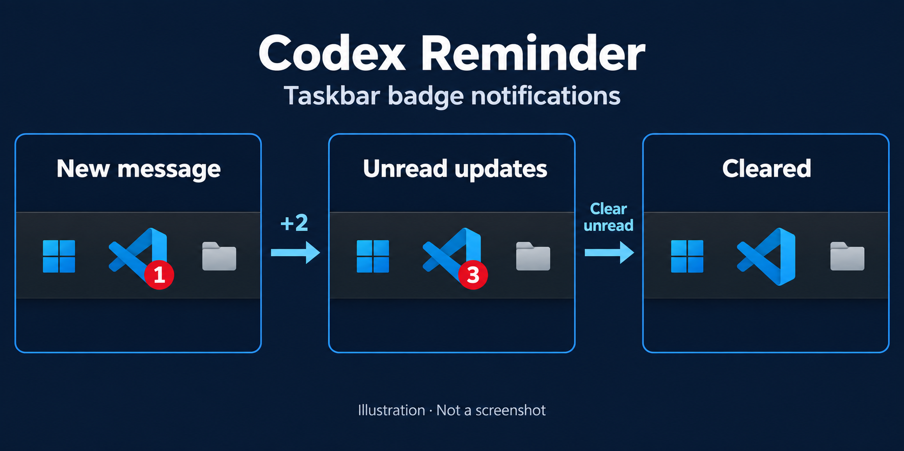
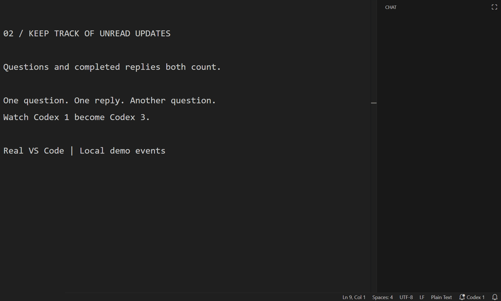
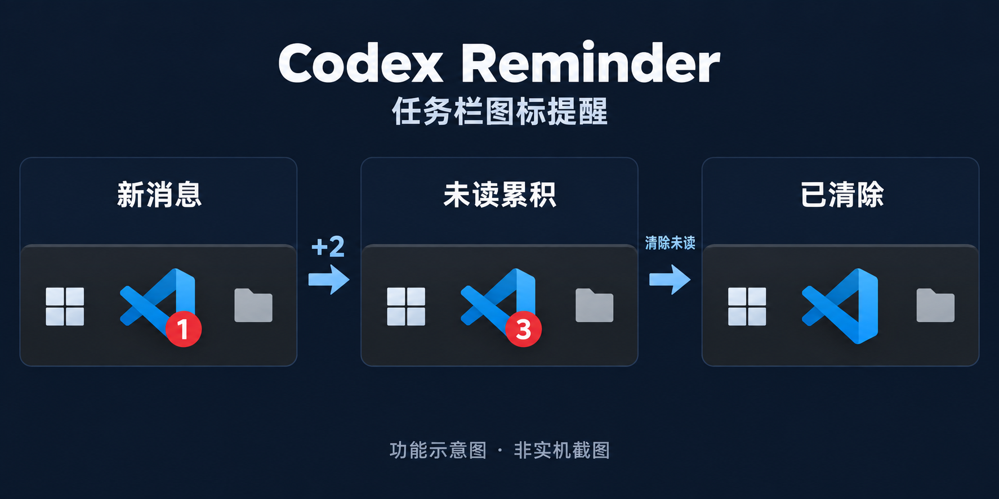

# Codex Reminder

> Unofficial community extension. Codex Reminder is not affiliated with, endorsed by, or supported by OpenAI.

See when Codex has replied or needs your input without repeatedly returning to its conversation. Codex Reminder shows a local unread count in the VS Code status bar and, on Windows, as a numeric taskbar overlay.

[Install from the VS Code Marketplace](https://marketplace.visualstudio.com/items?itemName=czqmike.codex-reminder) · [Download a release VSIX](https://github.com/czqmike/CodexReminder/releases) · [中文说明](#中文说明)

## Features

- Counts completed Codex replies and synchronous/asynchronous input prompts (`request_user_input` and `request_user_input_async`).
- Shows a true numeric Windows taskbar overlay using `ITaskbarList3.SetOverlayIcon`.
- Provides a clickable `Codex N` status bar item on Windows, Linux, and macOS.
- Clears the relevant count when the Codex conversation is opened or becomes visible.
- Filters by workspace and ignores reviewer and sub-agent threads.
- Works locally without telemetry or network requests.

## See it in action

### Taskbar count: increase and clear

The VS Code taskbar icon shows `1` unread item, then `3` as more replies or questions arrive. Clearing unread items removes the red overlay entirely.



*AI-generated feature illustration, not a screenshot. It uses generic taskbar icons and contains no user data.*

### Real recording: unread updates accumulate

A completed reply and another question increase the status-bar count from `Codex 1` to `Codex 3`.



Recorded in a real VS Code window on Windows, using an isolated profile and local sample events. The reminder source is the same as version 1.0.2; no live Codex request or private conversation is used. The recording shows the status bar; the Windows taskbar is outside the captured area.

## Requirements

- VS Code 1.130 or newer.
- The official Codex extension (`openai.chatgpt`), installed automatically as an extension dependency.
- Windows 10/11 for the numeric system taskbar overlay. Linux and macOS use the VS Code status bar only.
- A local UI Extension Host. Install Codex Reminder locally when using SSH, WSL, or Dev Containers.

## Install

From VS Code, open Extensions, search for `Codex Reminder`, and select **Install**. You can also run:

```sh
code --install-extension czqmike.codex-reminder
```

For a local release package, run **Extensions: Install from VSIX…** and select `codex-reminder.vsix`. Then run **Developer: Reload Window**.

### Try it in 30 seconds

1. Run **Codex Reminder: Test Taskbar Badge** from the Command Palette.
2. Look for `Codex 1` on the right side of the status bar. Windows also shows a numeric overlay on the VS Code taskbar icon.
3. Run **Codex Reminder: Clear Unread Count** to clear both indicators.

When a new reply or input request arrives in a conversation you are not currently viewing, the count increases. Already-visible messages in the focused Codex conversation are not counted. Clicking `Codex N` opens the Codex sidebar and clears all unread items for that workspace.

## How it works

Codex Reminder monitors local Codex session events under `CODEX_HOME/sessions` (or `~/.codex/sessions`) and the current Extension Host's `openai.chatgpt/Codex.log`. It counts only user-created VS Code threads for the current workspace. The extension does not modify those files.

### Privacy

| Area | Behavior |
| --- | --- |
| Files read | Local Codex JSONL event files and `Codex.log` |
| Fields used | Session/thread/workspace identifiers, event type/call identifier, and view/read state |
| Local storage | Unread counts keyed by thread identifier in VS Code workspace state |
| Response text | Records are parsed locally, but response text is not used, logged, or persisted by this extension |
| Network | No telemetry, uploads, or outbound network requests |

Use **Codex Reminder: Clear Unread Count** to remove the stored unread state for the current workspace. Uninstalling the extension removes its VS Code extension storage according to VS Code's normal lifecycle.

## Commands

| Command | Purpose |
| --- | --- |
| `Codex Reminder: Open Codex and Mark Read` | Open Codex and clear the current unread count |
| `Codex Reminder: Clear Unread Count` | Clear all unread counts in this workspace |
| `Codex Reminder: Test Taskbar Badge` | Add a local test unread item |
| `Codex Reminder: Show Diagnostic Output` | Open the extension output channel |

## Settings

| Setting | Default | Purpose |
| --- | --- | --- |
| `codexReminder.enabled` | `true` | Enable monitoring and presentation |
| `codexReminder.showStatusBar` | `true` | Show the clickable status bar fallback |
| `codexReminder.clearActiveThreadOnFocus` | `true` | Clear a visible thread when the window regains focus |
| `codexReminder.pollIntervalMs` | `1000` | Local event polling interval, from 300 to 10000 ms |
| `codexReminder.maxTaskbarCount` | `99` | Largest number shown before a plus sign |
| `codexReminder.codexHome` | empty | Override `CODEX_HOME` / `~/.codex` |

## Compatibility and limitations

Version **1.0.2** adds support for `request_user_input_async`, while keeping `request_user_input` support. This fixes missing question reminders after newer Codex updates. Repeated records with the same call ID count only once.

Local validation used VS Code 1.138 on Windows and question records produced by Codex extension `openai.chatgpt-26.908.40401`. The extension reads Codex local event and diagnostic formats; changes to those formats may require a corresponding Codex Reminder update.

The reminder applies to user-created **VS Code** Codex sessions in the current workspace. Standalone Codex desktop, CLI, reviewer, and sub-agent sessions are not counted. An empty unread count hides the status item. The Windows indicator is a taskbar overlay, not an Activity Bar badge.

Virtual workspaces are not supported because local Codex files are required. Untrusted local workspaces are supported: the extension does not execute workspace code or read workspace file contents.

## Troubleshooting

1. If replies work but questions do not, install version **1.0.2 or newer** and reload the window.
2. Run **Codex Reminder: Test Taskbar Badge**.
3. Open **Output > Codex Reminder** and check the reported session and log paths.
4. Confirm that both Codex and Codex Reminder are installed in the local UI Extension Host.
5. For multiple VS Code windows, confirm that the active workspace name appears in the window title.
6. If PowerShell is restricted by device policy, the Windows overlay might be unavailable; the status bar remains usable.

For help, see [SUPPORT.md](SUPPORT.md). Security reports are covered by [SECURITY.md](SECURITY.md).

## Development

The extension has no runtime npm dependencies.

```powershell
npm ci
npm run check
npm run test:taskbar
npm run verify:package
code --install-extension .\dist\codex-reminder.vsix --force
```

Release maintainers should follow [RELEASING.md](RELEASING.md).

---

# 中文说明

> 非官方社区扩展。Codex Reminder 与 OpenAI 不存在隶属、认可或官方支持关系。

Codex 回复完成或需要你输入时，扩展会在 VS Code 状态栏显示本地未读计数；Windows 上还会显示数字任务栏角标，让你无需反复切回 Codex 会话检查进度。

[从 VS Code Marketplace 安装](https://marketplace.visualstudio.com/items?itemName=czqmike.codex-reminder) · [下载 Release 安装包](https://github.com/czqmike/CodexReminder/releases)

## 功能

- 统计 Codex 已完成的回复，以及 `request_user_input` 和 `request_user_input_async` 同步/异步提问。
- Windows 上通过 `ITaskbarList3.SetOverlayIcon` 显示真实数字任务栏角标。
- Windows、Linux 和 macOS 均提供可点击的 `Codex N` 状态栏入口。
- 打开对应 Codex 会话或让其重新可见时清除相关计数。
- 按工作区过滤，并排除 reviewer 和子代理线程。
- 全程本地运行，不包含遥测或网络请求。

## 功能演示

### 任务栏图标：计数增加与清除

VS Code 任务栏图标先显示 `1` 条未读，收到更多回复或提问后增加到 `3`。清除未读后，红色角标消失。



*此图为 AI 生成的功能示意图，非实机截图；仅使用通用图标，不含用户数据。*

### 实机录制：未读数量累计

再收到一条完成的回复和一次提问后，状态栏计数从 `Codex 1` 增加到 `Codex 3`。


GIF 录制自 Windows 上的真实 VS Code 窗口，使用隔离配置和本地示例事件。提醒逻辑与 1.0.2 源码一致，不使用真实 Codex 请求或私人会话。画面展示状态栏，Windows 任务栏不在录制区域内。

## 系统要求与安装

- VS Code 1.130 或更新版本。
- 官方 Codex 扩展 `openai.chatgpt`；Marketplace 会按依赖自动安装。
- 数字系统任务栏角标仅支持 Windows 10/11；Linux 和 macOS 使用状态栏。
- SSH、WSL 或 Dev Containers 场景下，请把本扩展安装在本地 UI Extension Host。

在 VS Code 扩展面板搜索 `Codex Reminder` 并安装，或运行：

```sh
code --install-extension czqmike.codex-reminder
```

也可以运行 **Extensions: Install from VSIX…**，选择下载的 `codex-reminder.vsix`，再执行 **Developer: Reload Window**。

## 30 秒试用

1. 在命令面板运行 **Codex Reminder: Test Taskbar Badge**。
2. 状态栏右侧出现 `Codex 1`；Windows 的 VS Code 任务栏图标同时显示数字角标。
3. 运行 **Codex Reminder: Clear Unread Count**，清除两处提醒。

未查看的会话收到回复或提问时，未读计数增加；当前聚焦且已显示的 Codex 会话不会重复提醒。点击 `Codex N` 会打开 Codex 侧栏，并清除当前工作区的全部未读计数。

## 工作方式与隐私

扩展只读取 `CODEX_HOME/sessions`（默认 `~/.codex/sessions`）下的本地 Codex JSONL 事件，以及当前 Extension Host 的 `openai.chatgpt/Codex.log`，不会修改这些文件。

- 使用的字段：会话、线程和工作区标识，事件类型/调用标识，以及会话可见和已读状态。
- 本地保存：按线程标识统计的未读数量，存放在 VS Code 工作区状态中。
- 回复正文：事件记录会在本机解析，但本扩展不会使用、记录或持久化回复正文。
- 网络行为：不发送遥测、不上传数据，也不发起任何外部网络请求。

运行 **Codex Reminder: Clear Unread Count** 可以删除当前工作区的未读状态。

## 兼容性与故障排查

**1.0.2** 新增 `request_user_input_async` 支持，并保留 `request_user_input` 兼容，修复新版 Codex 提问不提醒的问题。同一个调用 ID 的重复记录只计数一次。

本地验证使用 Windows 上的 VS Code 1.138，以及 Codex 扩展 `openai.chatgpt-26.908.40401` 生成的提问记录。扩展依赖 Codex 本地事件与诊断格式，这些格式变化时可能需要同步更新。

只统计当前工作区内用户创建的 **VS Code Codex 会话**；独立 Codex 桌面端、CLI、reviewer 和子代理会话不计入。没有未读时状态栏入口自动隐藏。Windows 的数字提醒位于系统任务栏图标，不是 VS Code 活动栏徽标。

若角标未出现：

1. 若回复会提醒、提问不提醒，请安装 **1.0.2 或更新版本**并重载窗口。
2. 运行 **Codex Reminder: Test Taskbar Badge**。
3. 查看 **Output > Codex Reminder** 中记录的会话与日志路径。
4. 确认 Codex 与本扩展都安装在本地 UI Extension Host。
5. 多窗口场景下，确认当前工作区名称出现在 VS Code 窗口标题中。
6. 如果设备策略禁止 PowerShell，Windows 任务栏角标可能不可用，但状态栏仍可使用。

命令和设置名称与英文部分完全相同；支持与安全报告方式请参阅 [SUPPORT.md](SUPPORT.md) 和 [SECURITY.md](SECURITY.md)。
