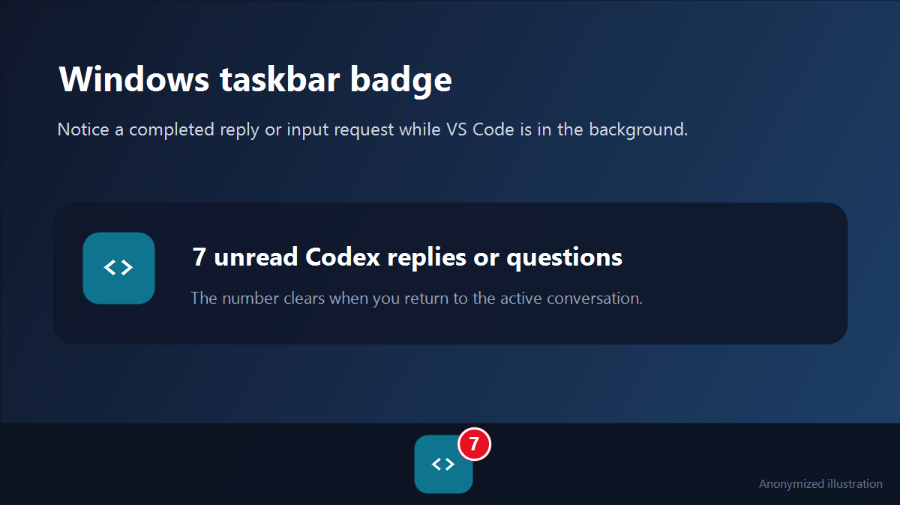
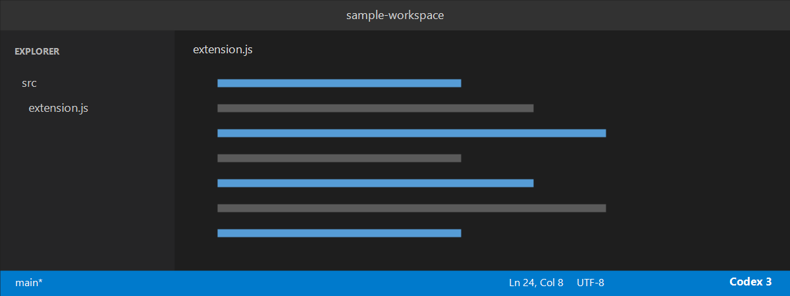

# Codex Reminder

> Unofficial community extension. Codex Reminder is not affiliated with, endorsed by, or supported by OpenAI.

See when Codex has replied or needs your input without repeatedly returning to its conversation. Codex Reminder shows a local unread count in the VS Code status bar and, on Windows, as a numeric taskbar overlay.

[Install from the VS Code Marketplace](https://marketplace.visualstudio.com/items?itemName=czqmike.codex-reminder)



## Features

- Counts completed Codex replies and synchronous/asynchronous input prompts (`request_user_input` and `request_user_input_async`).
- Shows a true numeric Windows taskbar overlay using `ITaskbarList3.SetOverlayIcon`.
- Provides a clickable `Codex N` status bar item on Windows, Linux, and macOS.
- Clears the relevant count when the Codex conversation is opened or becomes visible.
- Filters by workspace and ignores reviewer and sub-agent threads.
- Works locally without telemetry or network requests.



## Requirements

- VS Code 1.130 or newer.
- The official Codex extension (`openai.chatgpt`), installed automatically as an extension dependency.
- Windows 10/11 for the numeric system taskbar overlay. Linux and macOS use the VS Code status bar only.
- A local UI Extension Host. Install Codex Reminder locally when using SSH, WSL, or Dev Containers.

## Install

From VS Code, open Extensions, search for `Codex Reminder`, and select **Install**. You can also run:

```sh
code --install-extension czqmike.codex-reminder
```

After installation, run **Developer: Reload Window** if the extension does not activate immediately.

## How it works

Codex Reminder monitors local Codex session events under `CODEX_HOME/sessions` (or `~/.codex/sessions`) and the current Extension Host's `openai.chatgpt/Codex.log`. It counts only user-created VS Code threads for the current workspace. The extension does not modify those files.

### Privacy

| Area | Behavior |
| --- | --- |
| Files read | Local Codex JSONL event files and `Codex.log` |
| Fields used | Session/thread/workspace identifiers, event type/call identifier, and view/read state |
| Local storage | Unread counts keyed by thread identifier in VS Code workspace state |
| Response text | Records are parsed locally, but response text is not used, logged, or persisted by this extension |
| Network | No telemetry, uploads, or outbound network requests |

Use **Codex Reminder: Clear Unread Count** to remove the stored unread state for the current workspace. Uninstalling the extension removes its VS Code extension storage according to VS Code's normal lifecycle.

## Commands

| Command | Purpose |
| --- | --- |
| `Codex Reminder: Open Codex and Mark Read` | Open Codex and clear the current unread count |
| `Codex Reminder: Clear Unread Count` | Clear all unread counts in this workspace |
| `Codex Reminder: Test Taskbar Badge` | Add a local test unread item |
| `Codex Reminder: Show Diagnostic Output` | Open the extension output channel |

## Settings

| Setting | Default | Purpose |
| --- | --- | --- |
| `codexReminder.enabled` | `true` | Enable monitoring and presentation |
| `codexReminder.showStatusBar` | `true` | Show the clickable status bar fallback |
| `codexReminder.clearActiveThreadOnFocus` | `true` | Clear a visible thread when the window regains focus |
| `codexReminder.pollIntervalMs` | `1000` | Local event polling interval, from 300 to 10000 ms |
| `codexReminder.maxTaskbarCount` | `99` | Largest number shown before a plus sign |
| `codexReminder.codexHome` | empty | Override `CODEX_HOME` / `~/.codex` |

## Compatibility and limitations

The 1.0.0 event parser was developed against VS Code 1.130 and Codex extension build `openai.chatgpt-26.721.41059`. Codex does not currently expose a public reply-event API, so this extension relies on local Codex event and diagnostic formats. A future Codex update may require a corresponding Codex Reminder update.

Virtual workspaces are not supported because local Codex files are required. Untrusted local workspaces are supported: the extension does not execute workspace code or read workspace file contents.

## Troubleshooting

1. Run **Codex Reminder: Test Taskbar Badge**.
2. Open **Output > Codex Reminder** and check the reported session and log paths.
3. Confirm that both Codex and Codex Reminder are installed in the local UI Extension Host.
4. For multiple VS Code windows, confirm that the active workspace name appears in the window title.
5. If PowerShell is restricted by device policy, the Windows overlay might be unavailable; the status bar remains usable.

For help, see [SUPPORT.md](SUPPORT.md). Security reports are covered by [SECURITY.md](SECURITY.md).

## Development

The extension has no runtime npm dependencies.

```powershell
npm ci
npm run check
npm run test:taskbar
npm run verify:package
code --install-extension .\dist\codex-reminder.vsix --force
```

Release maintainers should follow [RELEASING.md](RELEASING.md).

---

# 中文说明

> 非官方社区扩展。Codex Reminder 与 OpenAI 不存在隶属、认可或官方支持关系。

Codex 回复完成或需要你输入时，扩展会在 VS Code 状态栏显示本地未读计数；Windows 上还会显示数字任务栏角标，让你无需反复切回 Codex 会话检查进度。

[从 VS Code Marketplace 安装](https://marketplace.visualstudio.com/items?itemName=czqmike.codex-reminder)

## 功能

- 统计 Codex 已完成的回复，以及 `request_user_input` 和 `request_user_input_async` 同步/异步提问。
- Windows 上通过 `ITaskbarList3.SetOverlayIcon` 显示真实数字任务栏角标。
- Windows、Linux 和 macOS 均提供可点击的 `Codex N` 状态栏入口。
- 打开对应 Codex 会话或让其重新可见时清除相关计数。
- 按工作区过滤，并排除 reviewer 和子代理线程。
- 全程本地运行，不包含遥测或网络请求。

## 系统要求与安装

- VS Code 1.130 或更新版本。
- 官方 Codex 扩展 `openai.chatgpt`；Marketplace 会按依赖自动安装。
- 数字系统任务栏角标仅支持 Windows 10/11；Linux 和 macOS 使用状态栏。
- SSH、WSL 或 Dev Containers 场景下，请把本扩展安装在本地 UI Extension Host。

在 VS Code 扩展面板搜索 `Codex Reminder` 并安装，或运行：

```sh
code --install-extension czqmike.codex-reminder
```

## 工作方式与隐私

扩展只读取 `CODEX_HOME/sessions`（默认 `~/.codex/sessions`）下的本地 Codex JSONL 事件，以及当前 Extension Host 的 `openai.chatgpt/Codex.log`，不会修改这些文件。

- 使用的字段：会话、线程和工作区标识，事件类型/调用标识，以及会话可见和已读状态。
- 本地保存：按线程标识统计的未读数量，存放在 VS Code 工作区状态中。
- 回复正文：事件记录会在本机解析，但本扩展不会使用、记录或持久化回复正文。
- 网络行为：不发送遥测、不上传数据，也不发起任何外部网络请求。

运行 **Codex Reminder: Clear Unread Count** 可以删除当前工作区的未读状态。

## 兼容性与故障排查

1.0.0 的事件解析器针对 VS Code 1.130 和 Codex 扩展 `openai.chatgpt-26.721.41059` 开发。由于 Codex 当前没有公开的回复事件 API，本扩展依赖其本地事件和诊断格式；Codex 更新后可能需要同步更新本扩展。

若角标未出现：

1. 运行 **Codex Reminder: Test Taskbar Badge**。
2. 查看 **Output > Codex Reminder** 中记录的会话与日志路径。
3. 确认 Codex 与本扩展都安装在本地 UI Extension Host。
4. 多窗口场景下，确认当前工作区名称出现在 VS Code 窗口标题中。
5. 如果设备策略禁止 PowerShell，Windows 任务栏角标可能不可用，但状态栏仍可使用。

命令和设置名称与英文部分完全相同；支持与安全报告方式请参阅 [SUPPORT.md](SUPPORT.md) 和 [SECURITY.md](SECURITY.md)。
